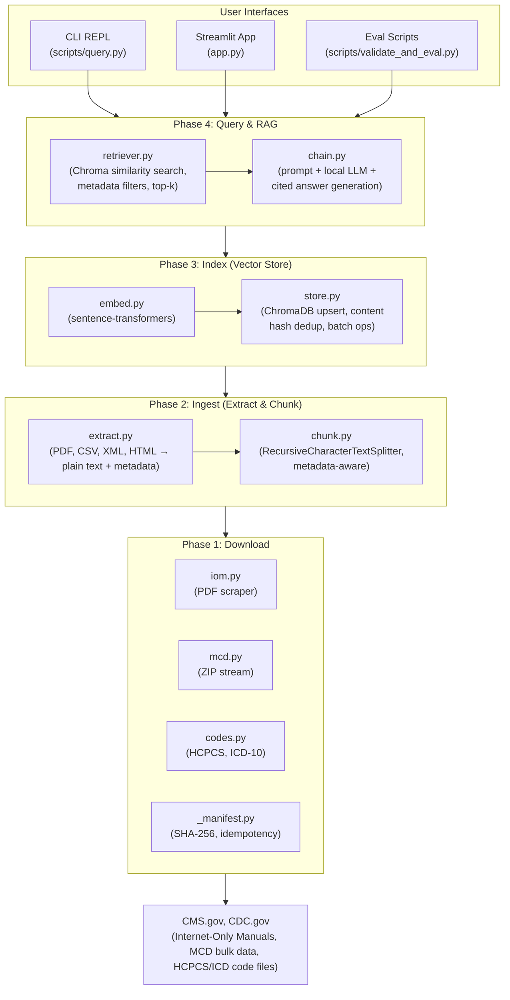
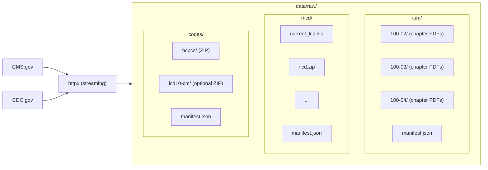
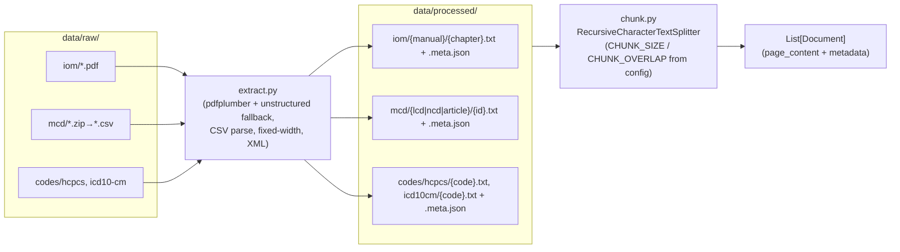
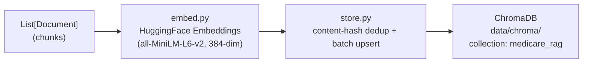
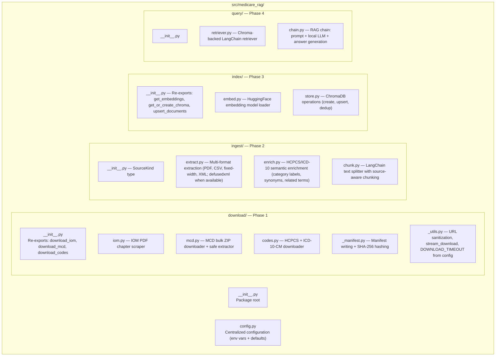
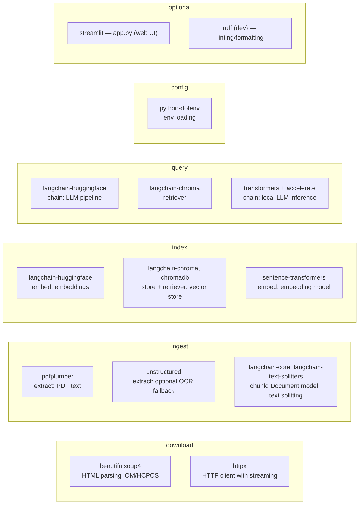

# Architecture

This document describes the high-level architecture, data flow, component design, and key technical decisions of the Medicare RAG POC system.

## System Overview

Medicare RAG is a four-phase Retrieval-Augmented Generation pipeline for Medicare Revenue Cycle Management. It downloads authoritative CMS data, transforms it into searchable vector embeddings, and answers natural-language questions with cited sources. The entire system runs locally with no external API keys.

## Data Flow

The pipeline processes data through four sequential phases. Each phase is idempotent and can be re-run independently.

### Phase 1: Download → `data/raw/`

External CMS and CDC sources are downloaded into `data/raw/` with manifest-based idempotency.

**Three data sources:**

| Source | Module | Content | Format |
|--------|--------|---------|--------|
| **IOM** (Internet-Only Manuals) | `download/iom.py` | Medicare Benefit Policy (100-02), NCD (100-03), Claims Processing (100-04) | Chapter PDFs scraped from CMS index pages |
| **MCD** (Medicare Coverage Database) | `download/mcd.py` | LCDs, NCDs, Articles | Single bulk ZIP containing inner ZIPs with CSV data |
| **Codes** | `download/codes.py` | HCPCS Level II codes, optional ICD-10-CM | HCPCS ZIP from CMS quarterly page; ICD-10-CM from CDC (env-configured URL) |

**Key design decisions:**
- All HTTP uses `httpx` with streaming for large files and a shared timeout (default 60s, overridable via `DOWNLOAD_TIMEOUT`)
- Filenames are sanitized via `_utils.sanitize_filename_from_url()` (including percent-decoding) to prevent path traversal
- ZIP extraction uses `_safe_extract_zip()` which validates that resolved paths stay within the output directory (zip-slip protection)
- Each source writes a `manifest.json` containing source URL, download date, and file list with SHA-256 hashes
- Re-runs skip downloads when manifests and files exist (use `--force` to override)

### Phase 2: Ingest → `data/processed/`

Raw files are extracted into plain text with structured metadata, then chunked into LangChain `Document` objects.

**Extraction strategies by source type:**

| Source | Extractor | Details |
|--------|-----------|---------|
| IOM PDFs | `pdfplumber` | Per-page text extraction; falls back to `unstructured` (optional dep) if < 50 chars/page |
| MCD CSVs | `csv.DictReader` | Parses inner ZIPs → CSVs; HTML-strips cell content via BeautifulSoup; one document per row |
| HCPCS | Fixed-width parser | 320-char record layout; merges continuation lines (RIC 4/8); one document per code |
| ICD-10-CM | `defusedxml` (when available) or `xml.etree` | Extracts `<code>` + `<desc>` pairs from tabular XML inside ZIP; defusedxml used when available for safe parsing |

**Semantic enrichment (`enrich.py`):**

Before writing HCPCS and ICD-10-CM documents to disk, the extraction step enriches their text with category labels, synonyms, and related terms via `enrich_hcpcs_text()` and `enrich_icd10_text()`. This prepends a structured enrichment string to each code document:

- **HCPCS:** Maps the code's letter prefix (with sub-range granularity) to a category label and related terms. For example, E-codes get: *"HCPCS E-codes: Durable Medical Equipment. Related terms: durable medical equipment, DME, wheelchair, hospital bed, oxygen equipment, CPAP, BiPAP, walker..."*
- **ICD-10-CM:** Maps the code's chapter range to a category label and related terms. For example, I-codes get: *"ICD-10-CM (I00-I99): Diseases of the Circulatory System. Related terms: cardiovascular disease, heart disease, hypertension, heart failure, atrial fibrillation..."*

This enrichment bridges the semantic gap between terse code descriptions and natural-language queries, enabling the embedding model to match queries like "What HCPCS codes are used for durable medical equipment?" to code records that would otherwise only contain clinical abbreviations.

**Metadata schema:** Every extracted document produces a `.meta.json` alongside its `.txt`, containing:
- `source` — `"iom"`, `"mcd"`, or `"codes"`
- `manual` — e.g. `"100-02"` (IOM only)
- `chapter` — derived from filename patterns (IOM only)
- `title`, `effective_date`, `source_url`, `jurisdiction` — from source data where available
- `doc_id` — unique identifier combining source type and document key

**Chunking policy:**
- Policy documents (IOM, MCD): `RecursiveCharacterTextSplitter` with configurable chunk size and overlap (defaults 1000 and 200 via `CHUNK_SIZE`, `CHUNK_OVERLAP`); separators: `\n\n`, `\n`, `. `, ` `, `""`
- Code documents (HCPCS, ICD-10-CM): kept as single chunks (one document per code entry) since they are short, self-contained records
- Chunk metadata inherits from parent document and adds `chunk_index` and `total_chunks`

### Phase 3: Index → `data/chroma/`

Chunked documents are embedded and stored in a local ChromaDB vector store with incremental upsert logic.

**Embedding model:** `sentence-transformers/all-MiniLM-L6-v2` (384 dimensions) by default, configurable via `EMBEDDING_MODEL` env var. Uses `langchain_huggingface.HuggingFaceEmbeddings` wrapper for LangChain compatibility.

**Incremental upsert algorithm:**
1. Fetch all existing document IDs and their `content_hash` values from ChromaDB (batched via `GET_META_BATCH_SIZE`, default 500, to avoid SQLite variable limits)
2. For each incoming chunk, compute `content_hash` = SHA-256 of `page_content + doc_id + chunk_index`
3. Skip chunks whose hash matches the stored hash (unchanged content)
4. Embed only new/changed chunks, then upsert in batches of `CHROMA_UPSERT_BATCH_SIZE` (default 5000, under ChromaDB's limit)
5. Metadata is sanitized to ChromaDB-compatible types (str, int, float, bool only; None values dropped)

**Chunk ID scheme:** `{doc_id}_{chunk_index}` for chunked documents, or plain `{doc_id}` for single-chunk code documents.

### Phase 4: Query & RAG

The retrieval and generation layer connects ChromaDB similarity search to a local LLM.

**Retriever:** `langchain_chroma.Chroma.as_retriever()` with configurable `k` (default 8) and optional metadata filter (Chroma `where` clause). Supports filtering by `source`, `manual`, `jurisdiction`, and combinations via `$and`.

**RAG chain:**
1. Retrieve top-k chunks by cosine similarity
2. Format context as numbered items: `[1] chunk_content`, `[2] chunk_content`, ...
3. Build a `ChatPromptTemplate` with system + human messages
4. Invoke local LLM via `HuggingFacePipeline` → `ChatHuggingFace`
5. Return `{"answer": str, "source_documents": list[Document]}`

**LLM configuration:**
- Default model: `TinyLlama/TinyLlama-1.1B-Chat-v1.0`
- Device placement via `device_map` (supports `auto`, `cpu`, or specific device)
- Generation params: `max_new_tokens=512`, `do_sample=False`, `repetition_penalty=1.05`
- All configurable via environment variables

## Component Architecture

### Package Structure

### Configuration (`config.py`)

All configuration is centralized in a single module that loads `.env` via `python-dotenv` and provides sensible defaults.

| Config | Default | Env Override |
|--------|---------|-------------|
| `DATA_DIR` | `{repo_root}/data` | `DATA_DIR` |
| `RAW_DIR` | `{DATA_DIR}/raw` | — |
| `PROCESSED_DIR` | `{DATA_DIR}/processed` | — |
| `CHROMA_DIR` | `{DATA_DIR}/chroma` | — |
| `COLLECTION_NAME` | `"medicare_rag"` | — |
| `EMBEDDING_MODEL` | `"sentence-transformers/all-MiniLM-L6-v2"` | `EMBEDDING_MODEL` |
| `LOCAL_LLM_MODEL` | `"TinyLlama/TinyLlama-1.1B-Chat-v1.0"` | `LOCAL_LLM_MODEL` |
| `LOCAL_LLM_DEVICE` | `"auto"` | `LOCAL_LLM_DEVICE` |
| `LOCAL_LLM_MAX_NEW_TOKENS` | `512` | `LOCAL_LLM_MAX_NEW_TOKENS` (invalid → default + warning) |
| `LOCAL_LLM_REPETITION_PENALTY` | `1.05` | `LOCAL_LLM_REPETITION_PENALTY` (invalid → default + warning) |
| `DOWNLOAD_TIMEOUT` | `60.0` | `DOWNLOAD_TIMEOUT` |
| `CHUNK_SIZE` | `1000` | `CHUNK_SIZE` |
| `CHUNK_OVERLAP` | `200` | `CHUNK_OVERLAP` |
| `CHROMA_UPSERT_BATCH_SIZE` | `5000` | `CHROMA_UPSERT_BATCH_SIZE` |
| `GET_META_BATCH_SIZE` | `500` | `GET_META_BATCH_SIZE` |

### Scripts (CLI Entry Points)

| Script | Purpose | Key Arguments |
|--------|---------|---------------|
| `scripts/download_all.py` | Run Phase 1 downloads | `--source`, `--force` |
| `scripts/ingest_all.py` | Run Phases 2-3 (extract, chunk, embed, store) | `--source`, `--force`, `--skip-extract`, `--skip-index` |
| `scripts/query.py` | Interactive RAG REPL | `--filter-source`, `--filter-manual`, `--filter-jurisdiction`, `-k` |
| `scripts/validate_and_eval.py` | Index validation + retrieval evaluation | `--validate-only`, `--eval-only`, `-k`, `--k-values`, `--json`, `--report` |
| `scripts/run_rag_eval.py` | Full RAG eval (LLM answers) report | `--eval-file`, `--out`, `-k` |

### Streamlit App (`app.py`)

An optional web UI for interactive embedding search. Provides:
- Semantic similarity search with distance scores
- Sidebar filters (source, manual, jurisdiction)
- Quick-check bubble questions for common Medicare topics
- Styled result cards with metadata pills
- Embedding dimension mismatch detection and user-friendly error messages
- Collection metadata cached with 5-minute TTL

Uses `get_raw_collection(store)` from `index.store` to access the Chroma wrapper's underlying collection for batched metadata retrieval and dimension checks (wraps the private `_collection` API).

## Key Technical Decisions

### Why local-only (no API keys)?

The system uses `sentence-transformers` for embeddings and a local HuggingFace model for generation. This eliminates API costs, removes network dependency during inference, and ensures data privacy for sensitive Medicare content.

### Why ChromaDB?

ChromaDB was chosen as the vector store for its simplicity, local persistence, and LangChain integration. It persists to disk at `data/chroma/` and requires no external server process.

### Incremental indexing by content hash

Instead of rebuilding the entire index on each ingest, the system computes a SHA-256 hash of each chunk's content + metadata identifiers. Only chunks with new or changed hashes are re-embedded and upserted, significantly reducing re-indexing time for large corpora.

### Source-aware chunking

Code documents (HCPCS, ICD-10-CM) are short, self-contained records that should not be split across chunks. The chunking layer treats them as single documents while applying recursive character splitting (with overlap) to longer policy documents from IOM and MCD.

### Metadata-enriched retrieval

Every chunk carries structured metadata (`source`, `manual`, `chapter`, `jurisdiction`, etc.) through the entire pipeline. This enables filtered retrieval (e.g., "only IOM 100-02" or "only JL jurisdiction") and supports the evaluation framework's per-source and per-category breakdowns.

### Zip-slip protection

All ZIP extraction (MCD bulk data, nested CSVs, ICD-10-CM) validates that extracted file paths resolve within the target directory using `Path.resolve()` and `is_relative_to()`, preventing directory traversal attacks.

## Evaluation Framework

The system includes a comprehensive retrieval evaluation suite driven by `scripts/eval_questions.json` (60 Medicare-focused questions with expected keywords, sources, categories, and difficulty levels).

**Metrics computed:**
- **Hit Rate** — fraction of questions where at least one fully relevant document appears in top-k
- **MRR** (Mean Reciprocal Rank) — average of 1/rank of the first relevant document
- **Precision@k** — fraction of top-k results that are fully relevant
- **NDCG@k** — Normalized Discounted Cumulative Gain
- **Consistency** — Jaccard similarity of result sets for rephrased versions of the same question
- **Latency** — p50, p95, p99 retrieval times

**Breakdowns by:**
- Category (policy_coverage, claims_billing, coding_modifiers, code_lookup, lcd_policy, etc.)
- Difficulty (easy, medium, hard)
- Expected source (iom, mcd, codes)
- Multi-k sweep (e.g., k=1,3,5,10)

## Dependency Graph

## Testing Strategy

Tests live in `tests/` and run via `pytest`. All external dependencies (HTTP, file I/O, models) are mocked using `unittest.mock`.

| Test Module | Coverage Area | Strategy |
|-------------|---------------|----------|
| `test_download.py` | Phase 1: downloaders | Mocked HTTP responses, manifest verification, zip-slip protection, idempotency checks |
| `test_ingest.py` | Phase 2: extraction + chunking | Fixtures with sample PDFs/CSVs in `tmp_path`, metadata schema validation, enrichment integration |
| `test_enrich.py` | Phase 2: semantic enrichment | HCPCS prefix mapping (15 tests), ICD-10-CM chapter ranges (17 tests), edge cases, wrapper functions |
| `test_index.py` | Phase 3: embeddings + store | Mocked embeddings, ChromaDB in-memory; skipped when ChromaDB unavailable |
| `test_query.py` | Phase 4: retriever + chain | Mocked retriever and LLM, prompt template validation |
| `test_search_validation.py` | Validation + eval | Eval question schema checks, metric computation |
| `test_app.py` | Streamlit UI helpers | Metadata filter building, result rendering (requires `.[ui]`) |

**Test patterns:**
- Fixtures create isolated `tmp_path` directories
- `unittest.mock.patch` replaces network calls and heavy model loads
- Assertions verify file creation, manifest contents, and metadata correctness
- No network access or real data downloads needed
