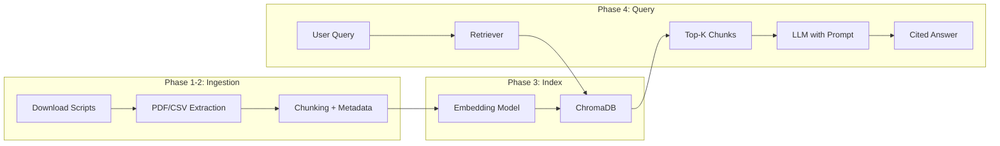

# Medicare RAG POC -- Phased Implementation Plan

This plan turns the corpus-building roadmap in [PLAN.md](PLAN.md) into a working, end-to-end RAG system you can query with natural-language Medicare RCM questions.

## Architecture Overview



## Tech Stack (POC-optimized)

- **Python 3.11+** with venv
- **LangChain** -- orchestration, document loaders, text splitters, retrieval chain
- **ChromaDB** -- local vector store, zero infrastructure
- **OpenRouter API** (for generation: e.g. `openai/gpt-4o` or `anthropic/claude-3.5-sonnet`; single API key, model choice via config). **Embeddings:** OpenAI `text-embedding-3-small` or HuggingFace sentence-transformers for local/cost-free option.
- **pdfplumber** -- PDF text extraction (better table handling than PyMuPDF for CMS docs)
- **Unstructured** -- fallback for complex/scanned PDFs
- **httpx** -- async bulk downloads from CMS
- **pytest** -- unit tests in the venv per your preference

---

## Phase 1: Project Scaffold and Data Download (Days 1-2)

**Goal:** Repo structure, dependency management, and automated download of the highest-value CMS data.

### 1a. Project structure

```
medicare_rag/
  src/
    medicare_rag/
      __init__.py
      download/        # download scripts per source
        iom.py         # Internet-Only Manuals
        mcd.py         # Medicare Coverage Database bulk ZIPs
        codes.py       # ICD-10, HCPCS
      ingest/          # extraction + chunking
        extract.py
        chunk.py
      index/           # embedding + vector store
        embed.py
        store.py
      query/           # retrieval + generation
        retriever.py
        chain.py
      config.py        # paths, model names, API keys: OPENROUTER_API_KEY, OPENAI_API_KEY (embeddings)
  tests/
    test_download.py
    test_ingest.py
    test_query.py
  data/               # .gitignored, raw downloads land here
    raw/
    processed/
  scripts/
    download_all.py   # CLI entry point for downloads
    ingest_all.py     # CLI entry point for ingestion
    query.py          # CLI entry point for querying
  pyproject.toml
  .env.example
  README.md
```

### 1b. Download scripts (priority order)

1. **IOM chapters** (`src/medicare_rag/download/iom.py`) -- scrape the CMS IOM index page for PDF links to manuals 100-02, 100-03, 100-04. Save to `data/raw/iom/{manual_id}/`.
2. **MCD bulk data** (`src/medicare_rag/download/mcd.py`) -- download the "Download All Data" ZIP from the MCD downloads page. Extract to `data/raw/mcd/`.
3. **Code files** (`src/medicare_rag/download/codes.py`) -- download latest ICD-10-CM XML/ZIP from CDC, HCPCS quarterly ZIP from CMS. Save to `data/raw/codes/`.

Each script should:

- Be idempotent (skip if file exists, unless `--force`)
- Log what it downloads
- Store a `manifest.json` with source URL, download date, file hashes

### 1c. Dependencies (`pyproject.toml`)

Key deps: `langchain`, `langchain-openai` (for embeddings and/or OpenRouter-compatible chat via OpenAI client with base_url), `langchain-community`, `chromadb`, `pdfplumber`, `unstructured`, `httpx`, `python-dotenv`, `pytest`. Use OpenRouter base URL + API key for chat; model id is the provider path (e.g. `openai/gpt-4o`).

---

## Phase 2: Text Extraction and Chunking (Days 3-4)

**Goal:** Turn raw PDFs, CSVs, and XML into chunked, metadata-rich plain text documents ready for embedding.

### 2a. Extraction (`src/medicare_rag/ingest/extract.py`)

- **PDFs (IOMs, NCDs):** Use `pdfplumber` to extract text page-by-page. Fall back to `unstructured` for pages with poor extraction quality.
- **MCD bulk data (CSV/MDB with HTML):** Parse the CSV, extract the HTML narrative fields, convert to plain text with `beautifulsoup4`. Retain structured fields (LCD ID, jurisdiction, effective date, related codes) as metadata.
- **Code files (XML/CSV):** Parse ICD-10-CM XML into code-description pairs. Parse HCPCS CSV similarly.

Output: one text file per logical document (chapter, LCD, NCD, code section) in `data/processed/`, plus a sidecar `.meta.json` with:

```python
{
    "source": "iom",
    "manual": "100-02",
    "chapter": "6",
    "title": "Hospital Services Covered Under Part B",
    "effective_date": "2025-10-01",
    "source_url": "https://...",
    "jurisdiction": null  # or MAC jurisdiction for LCDs
}
```

### 2b. Chunking (`src/medicare_rag/ingest/chunk.py`)

- Use LangChain's `RecursiveCharacterTextSplitter` with ~1000 chars / ~200 token chunks and 200-char overlap.
- Attach parent-document metadata to every chunk.
- For code files (ICD-10, HCPCS), chunk by logical groupings (code range or category) rather than character count.
- Output: list of `Document` objects (LangChain) with `.page_content` and `.metadata`.

---

## Phase 3: Embedding and Indexing (Day 5)

**Goal:** Embed all chunks and store in a local ChromaDB collection.

### 3a. Embedding (`src/medicare_rag/index/embed.py`)

- Use `OpenAIEmbeddings(model="text-embedding-3-small")` (OpenAI) or `sentence-transformers` (HuggingFace) for cost-free iteration.
- Batch embed chunks (OpenAI supports up to 2048 inputs per call).
- Configurable via `config.py`: embedding model and API key (OpenAI for embeddings; OpenRouter is used for generation only).

### 3b. Vector store (`src/medicare_rag/index/store.py`)

- Initialize a ChromaDB persistent client at `data/chroma/`.
- Create a collection named `medicare_rag`.
- Upsert documents with their embeddings and metadata.
- Support incremental updates (check document hash before re-embedding).

**Notes:**

- Incremental indexing: only new or changed chunks (by `content_hash`) are embedded and upserted.
- Hash lookup currently uses a full-collection `get()`; for very large indices, consider batch get by chunk ids or a side index.

### 3c. CLI (`scripts/ingest_all.py`)

- Orchestrates: extract -> chunk -> embed -> store.
- Flags: `--source iom|mcd|codes|all`, `--force` to re-process.

---

## Phase 4: Retrieval and Query Chain (Days 6-7)

**Goal:** A working query interface that retrieves relevant Medicare policy chunks and generates cited answers.

### 4a. Retriever (`src/medicare_rag/query/retriever.py`)

- Wrap ChromaDB as a LangChain `VectorStoreRetriever` with `k=8`.
- Add metadata filtering (e.g., filter by source type, jurisdiction, manual).
- Optionally add a reranker step (e.g., Cohere rerank or a cross-encoder) to improve precision -- can defer to post-POC.

### 4b. RAG chain (`src/medicare_rag/query/chain.py`)

- Build a `RetrievalQA` chain (or the newer LCEL equivalent) with:
  - A system prompt tailored for Medicare RCM (instructs the LLM to cite sources, use policy language, flag when info is insufficient).
  - The retriever from 4a.
  - **OpenRouter** as the generation backend: use ChatOpenAI with `base_url="https://openrouter.ai/api/v1"` and `model` set from config (e.g. `openai/gpt-4o`, `anthropic/claude-3.5-sonnet`). API key: `OPENROUTER_API_KEY` from env.
- The prompt template should:
  - Identify the user's intent (coverage check, coding question, denial appeal, etc.).
  - Present retrieved chunks as numbered references.
  - Instruct the model to cite `[1]`, `[2]`, etc. in its answer.
  - Include a disclaimer that this is not legal/medical advice.

Example system prompt skeleton:

```
You are a Medicare Revenue Cycle Management assistant. Answer the
user's question using ONLY the provided context. Cite sources using
[1], [2], etc. If the context is insufficient, say so explicitly.

Context:
{context}

Question: {question}
```

### 4c. CLI query interface (`scripts/query.py`)

- Simple REPL loop: accept a question, run the chain, print the answer with source citations.
- Print metadata for each cited source (manual/chapter, LCD ID, etc.).

---

## Phase 5: Testing and Validation (Day 8)

**Goal:** Confidence that the pipeline works end-to-end with real Medicare questions.

### 5a. Unit tests (`tests/`)

- `test_download.py` -- mock HTTP, verify manifest creation, idempotency.
- `test_ingest.py` -- test extraction on a few sample PDFs, verify chunking output shape and metadata.
- `test_query.py` -- test retriever returns relevant docs for known queries (use a small fixture collection).

### 5b. Eval questions (manual, not automated)

Create a small eval set of ~10 questions spanning different source types:

| Category | Example Question |
| -------- | -------------------------------------------------------------------------------- |
| Coverage | "Is hyperbaric oxygen therapy covered for diabetic wounds?" |
| Coding | "What ICD-10 code maps to type 2 diabetes with foot ulcer?" |
| Billing | "What modifier is required for bilateral procedures under Medicare Part B?" |
| LCD | "Does Novitas (JL) have an LCD for cardiac rehab?" |
| Appeals | "What documentation is needed to appeal a Medicare denial for power wheelchair?" |

Run each through the query chain, manually assess answer quality and citation accuracy.

---

## Phase 6: Polish and Next Steps (Day 9-10)

- Add a simple **Streamlit** or **Gradio** UI for demo purposes.
- Add conversation memory (LangChain `ConversationBufferMemory`) for multi-turn Q&A.
- Document the setup in `README.md` (setup, env vars, how to download/ingest/query).
- Tag the repo as `v0.1-poc`.

### Post-POC roadmap (not in scope but worth noting)

- Hybrid search (BM25 + vector) for better recall on code lookups.
- Scheduled re-ingestion pipeline for quarterly CMS updates.
- Fine-tuned embedding model on Medicare terminology.
- Production deployment (API server, auth, logging, HIPAA controls).

---

## Todos

- **Phase 1a:** Create project structure, pyproject.toml, .env.example, venv setup
- **Phase 1b:** Implement download scripts for IOMs, MCD bulk data, and code files (ICD-10, HCPCS)
- **Phase 2a:** Build PDF/CSV/XML text extraction pipeline with pdfplumber and beautifulsoup4
- **Phase 2b:** Implement chunking with RecursiveCharacterTextSplitter and metadata attachment
- **Phase 3:** Set up embeddings (OpenAI or HuggingFace) and ChromaDB persistent vector store with upsert logic
- **Phase 4:** Build LangChain retrieval chain with OpenRouter for generation, Medicare-specific system prompt and citation format
- **Phase 4c:** Create CLI REPL for interactive querying
- **Phase 5:** Write unit tests for download, ingest, and query modules
- **Phase 6:** Add Streamlit/Gradio demo UI, conversation memory, and README documentation
